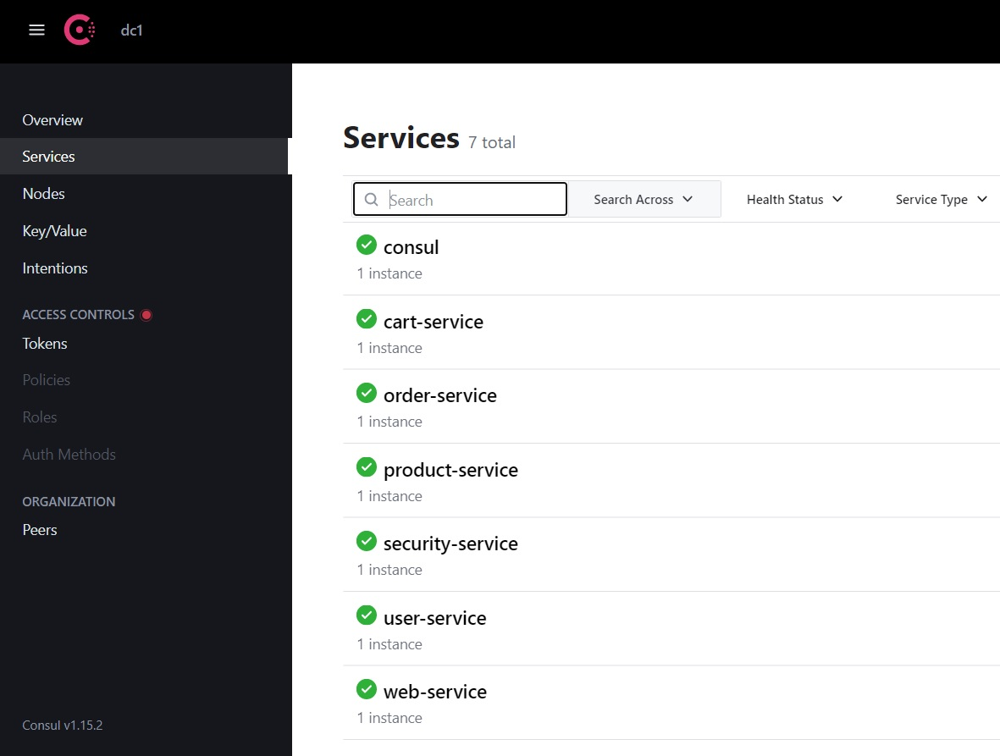
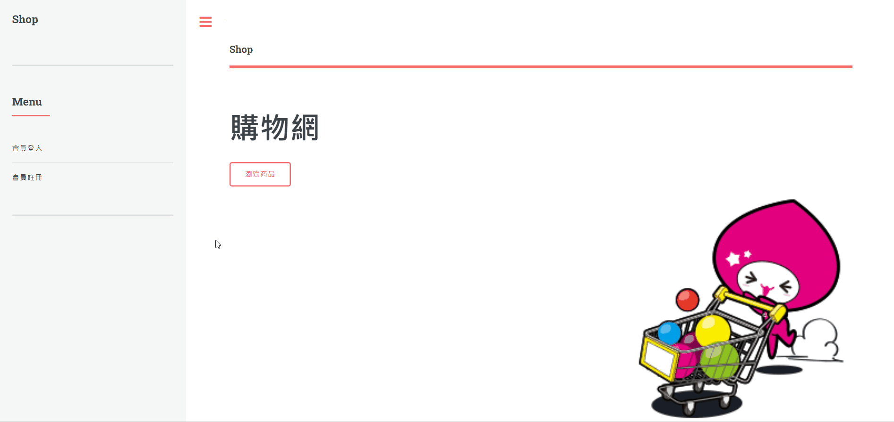
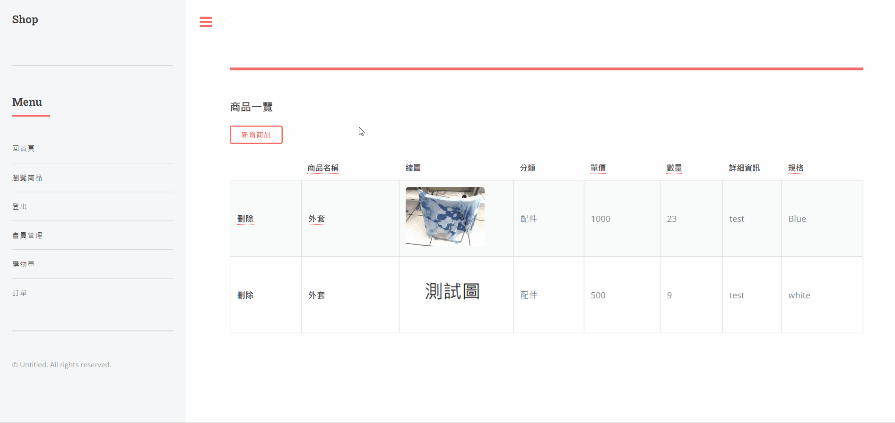
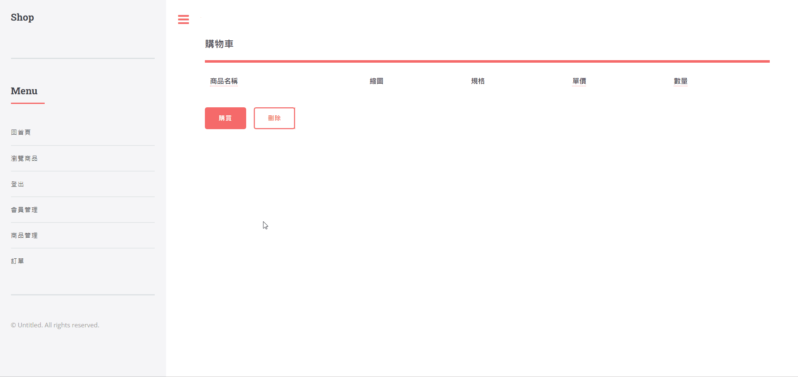
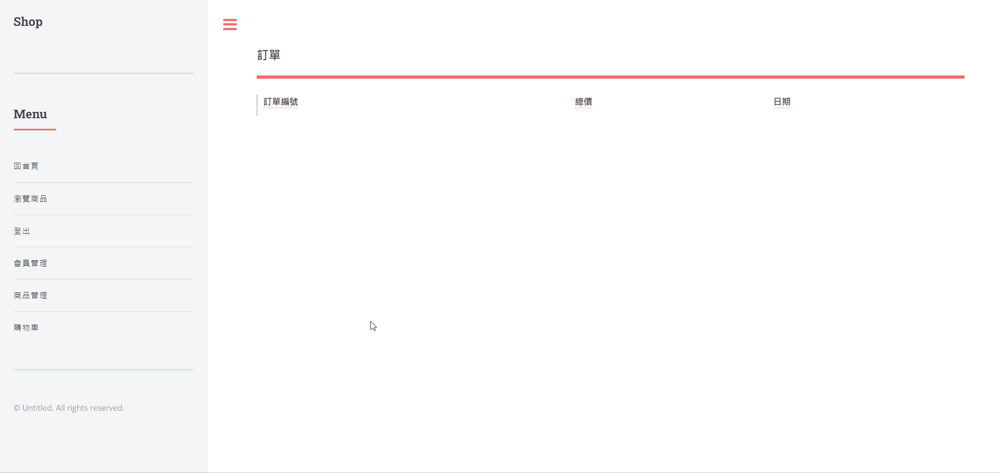
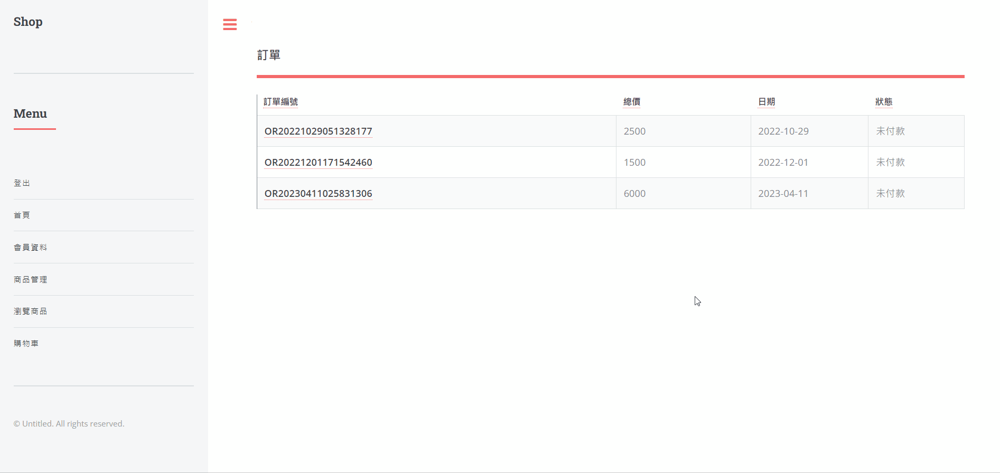

# Shop-Cloud

專案技術  
Java  
Spring Boot、Spring Security  Spring Cloud  
Consul  
Thymeleaf、JavaScript、Jquery、AJAX  
MySQL、Redis、Hibernate、JPQL、MyBatis  
綠界金流Ecpay

功能簡介
以Consul管理各項service  
  

註冊
以AJAX方式驗證帳號是否已存在  
密碼經BCrypt加密後存入資料庫
登入
OAuth2取得JWT Token
由Spring Security管理

新增商品、上傳圖片

加入購物車

加入訂單

結帳串接綠界金流ecpay

